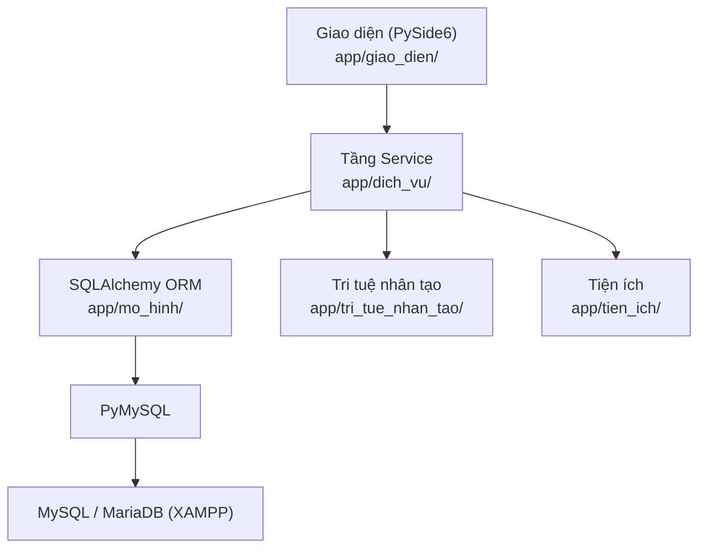
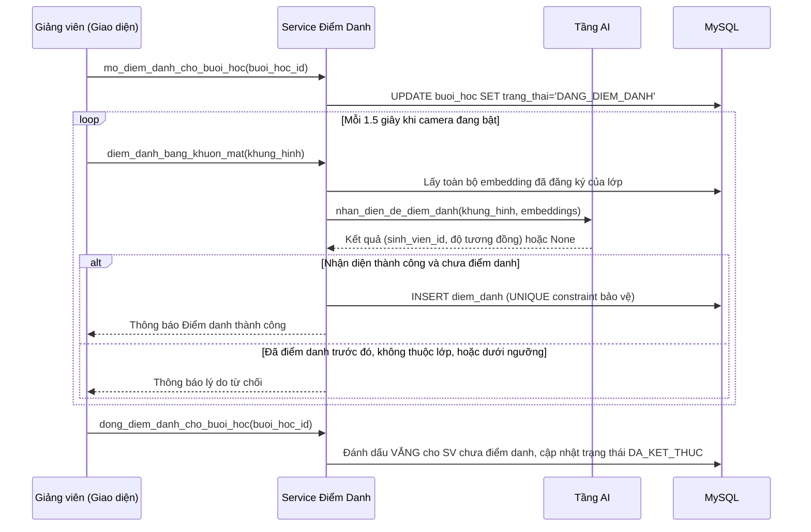

# Kiến Trúc Hệ Thống — Hệ Thống Điểm Danh Sinh Viên Bằng Khuôn Mặt

## 1. Kiến trúc phân tầng tổng quát

Hệ thống được tổ chức theo kiến trúc phân tầng (layered architecture), mỗi
tầng chỉ được phép gọi xuống tầng ngay bên dưới, không được phép nhảy tầng:



**Nguyên tắc bắt buộc:**
- Giao diện (`app/giao_dien/`) **không bao giờ** truy vấn CSDL trực tiếp —
  mọi thao tác dữ liệu đều đi qua tầng Service (`app/dich_vu/`).
- Mọi kiểm tra phân quyền (RBAC) được thực hiện **trong tầng Service**
  (`app/dich_vu/phan_quyen.py`), không chỉ dựa vào việc ẩn/hiện nút trên
  giao diện — đảm bảo an toàn ngay cả khi có lời gọi trái phép.
- Không nối chuỗi SQL từ dữ liệu người dùng; toàn bộ truy vấn qua
  SQLAlchemy ORM hoặc parameterized query.

## 2. Cấu trúc thư mục mã nguồn

```
app/
├── cau_hinh/         # Đọc cấu hình từ .env (CauHinhCoSoDuLieu, CauHinhBaoMat, CauHinhAI...)
├── co_so_du_lieu/    # Kết nối CSDL (ket_noi.py), khởi tạo (khoi_tao.py), Base ORM (mo_hinh.py)
├── mo_hinh/          # 14 model SQLAlchemy ORM, ánh xạ 1-1 tới 14 bảng MySQL
├── dich_vu/          # Toàn bộ nghiệp vụ: xác thực, phân quyền, CRUD, điểm danh, báo cáo...
├── tri_tue_nhan_tao/ # Pipeline AI: phát hiện, embedding, so sánh, chống giả mạo
├── giao_dien/        # 12 màn hình PySide6
├── tien_ich/         # Bảo mật, xuất Excel/PDF, ghi log, kiểm tra dữ liệu đầu vào
└── tai_nguyen/       # Model AI, ảnh, stylesheet (style.qss)
```

## 3. Pipeline nhận diện khuôn mặt (AI)

```mermaid
graph LR
    A[Camera / Ảnh] --> B[OpenCV đọc khung hình]
    B --> C{YOLO có sẵn?}
    C -- Có --> D[YOLO Face Detector]
    C -- Không --> E[OpenCV Haar Cascade dự phòng]
    D --> F[Face Alignment]
    E --> F
    F --> G{InsightFace có sẵn?}
    G -- Có --> H[InsightFace / ArcFace Embedding 512-D]
    G -- Không --> I[OpenCV HOG + Histogram Embedding dự phòng]
    H --> J[Kiểm tra người thật - Liveness]
    I --> J
    J --> K[Cosine Similarity so với embedding đã đăng ký]
    K --> L{Vượt ngưỡng?}
    L -- Có --> M[Xác định Sinh viên]
    L -- Không --> N[Từ chối / Không nhận diện được]
    M --> O[Kiểm tra sinh viên thuộc lớp học phần]
    O --> P[Kiểm tra buổi học đang mở điểm danh]
    P --> Q[Ghi bản ghi Điểm danh - UNIQUE constraint]
```



### 3.1. Cơ chế dự phòng (fallback)
Theo yêu cầu, hệ thống **ưu tiên** dùng YOLO (phát hiện khuôn mặt) và
InsightFace/ArcFace (trích xuất embedding). Tuy nhiên hai thư viện này khá
nặng và có thể không cài được trên một số máy sinh viên (yêu cầu
`onnxruntime`, tải model từ internet...). Vì vậy:

| Thành phần | Ưu tiên | Dự phòng khi không cài được |
|---|---|---|
| Phát hiện khuôn mặt | YOLO (`ultralytics`) | OpenCV Haar Cascade (`haarcascade_frontalface_default.xml`, có sẵn trong OpenCV) |
| Trích xuất embedding | InsightFace/ArcFace (512 chiều) | OpenCV HOG + histogram màu, chuẩn hóa L2 (fallback, độ chính xác thấp hơn) |

Việc chuyển đổi diễn ra **tự động, trong suốt** với người dùng — module
`app/tri_tue_nhan_tao/*.py` tự `try/except ImportError` khi khởi tạo và
chọn phương án khả dụng, đồng thời ghi log rõ phương pháp đang dùng. Màn
hình Cài Đặt và script `cai_dat.py` đều hiển thị phương pháp đang hoạt
động để người dùng biết.

### 3.2. Chống giả mạo (Liveness Detection)
`app/tri_tue_nhan_tao/kiem_tra_nguoi_that.py` phân tích một chuỗi khung
hình liên tiếp (không phải một ảnh tĩnh) để phát hiện các dấu hiệu của
người thật: độ nét khuôn mặt (variance of Laplacian) và mức độ chuyển động
tự nhiên giữa các khung hình — giúp giảm khả năng điểm danh hộ bằng ảnh in
hoặc ảnh trên điện thoại.

## 4. Luồng điểm danh bằng khuôn mặt (tuần tự)



## 5. Vì sao không dùng SQLite

Đề bài yêu cầu bắt buộc dùng MySQL/MariaDB thông qua XAMPP để:
1. Sinh viên thực hành thao tác thật với phpMyAdmin (Import/Export SQL,
   xem dữ liệu qua giao diện web) — kỹ năng cần thiết trong công việc thực
   tế nhiều hơn so với SQLite.
2. Hỗ trợ nhiều tiến trình/kết nối đồng thời tốt hơn SQLite (điểm danh có
   thể diễn ra đồng thời với xem báo cáo).
3. Kiểu dữ liệu `ENUM` gốc của MySQL giúp ràng buộc trạng thái (vai trò,
   trạng thái điểm danh...) chặt chẽ hơn so với TEXT của SQLite.
